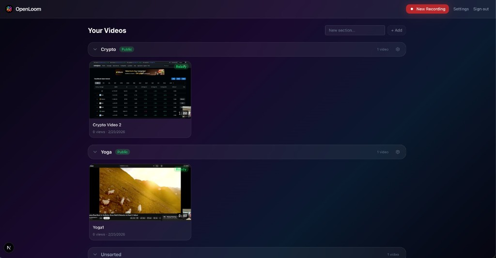

<p align="center">
  
</p>

<h1 align="center">OpenLoom</h1>

<p align="center">
  <strong>Self-hosted Loom alternative. Record screen, share link, own your data.</strong>
</p>

<p align="center">
  <a href="#quick-start">Quick Start</a> •
  <a href="#features">Features</a> •
  <a href="#self-hosting">Self-Hosting</a> •
  <a href="#the-story">The Story</a>
</p>

<p align="center">
  
  
</p>

---

<p align="center">
  
</p>

## What is this

Loom charges $12.50/user/month. Your videos live on their servers.

OpenLoom is the same thing — on your server, for free. Record screen + camera in the browser, get a shareable link, done.

## Quick Start

You need: a Linux server, Docker, a domain name ($10 on Cloudflare), two DNS A-records.

```bash
curl -fsSL https://raw.githubusercontent.com/openloom/OpenLoom/main/install.sh | bash
```

The script handles everything: checks your server, creates swap if RAM is low, verifies DNS, sets up HTTPS, builds and starts.

Open `https://yourdomain.com` — first user = admin, no invite code.

> **Tip:** If you want to modify or extend OpenLoom, open the project in [Cursor](https://cursor.com) and tell it what you want. This entire project was built that way.

## Features

- [x] Screen + webcam recording in browser
- [x] One-click shareable links (no login to watch)
- [x] Video sections / folders with public/private visibility
- [x] Access keys (permanent + single-use with fingerprint binding)
- [x] Invite-code registration
- [x] Auto HTTPS via Caddy + Let's Encrypt
- [x] S3 storage (MinIO included, works with AWS S3 / R2)
- [x] One-command install with smart preflight checks
- [x] Video duration, thumbnails, click-to-edit titles

### What's next

- [ ] AI transcription (Whisper — already in codebase, needs 2GB+ RAM)
- [ ] Timestamped comments
- [ ] Recording trimming
- [ ] Browser extension
- [ ] Team workspaces

## Self-Hosting

### You need

- **Linux VPS** — Ubuntu 22.04+ recommended. Even $6/mo DigitalOcean works.
- **1GB RAM** minimum — installer auto-creates swap if needed.
- **Docker** + **Docker Compose v2**
- **Domain** — required. Screen recording only works over HTTPS (browser security).
  - Two A-records: `yourdomain.com` + `s3.yourdomain.com` → your server IP
  - Cloudflare users: set both to **DNS only** (grey cloud)

### Install

```bash
git clone https://github.com/openloom/OpenLoom.git
cd OpenLoom
./install.sh
```

The installer:
1. Checks Docker, RAM, ports 80/443
2. Creates swap if RAM < 2GB
3. Asks for domain, verifies DNS resolves correctly
4. Detects Cloudflare proxy and tells you what to fix
5. Auto-disables Whisper on weak servers
6. Generates secure `.env`, builds, starts with HTTPS

### Update

```bash
cd ~/openloom
./update.sh
```

### Config

All config is in `.env`. Key variables:

| Variable | What it does |
|----------|-------------|
| `DOMAIN` | Your domain (required) |
| `SECRET_KEY` | JWT signing key (auto-generated) |
| `ENABLE_WHISPER` | Set `false` to skip Whisper compilation on low-RAM |
| `DISABLE_TRANSCRIPTION` | Set `true` to skip transcription at runtime |

Full list in [`.env.example`](.env.example).

## Tech Stack

Next.js 15 · React · TypeScript · Tailwind CSS · Prisma · PostgreSQL · MinIO (S3) · Redis · BullMQ · Caddy · Docker

## Architecture

```
Browser (record/upload/watch)
        │
    Caddy (HTTPS)
        │
   Next.js API ──── PostgreSQL (metadata)
        │
      MinIO (video files)
        │
   Worker (ffmpeg compose + optional Whisper transcription)
```

## The Story

This project was built entirely with vibe-coding in [Cursor](https://cursor.com). From zero to working self-hosted Loom alternative — recording, processing, sharing, deploy scripts, HTTPS, the whole thing.

If you're curious about building real products with AI-assisted development, this is what the output looks like. Not a toy demo — an actual deployable thing with install scripts, error handling, and production infrastructure.

**Want to modify it?** Open in Cursor, describe what you want. The codebase is clean enough that AI can navigate it.

## Contributing

PRs welcome. See [CONTRIBUTING.md](CONTRIBUTING.md).

## License

[AGPL-3.0](LICENSE)
